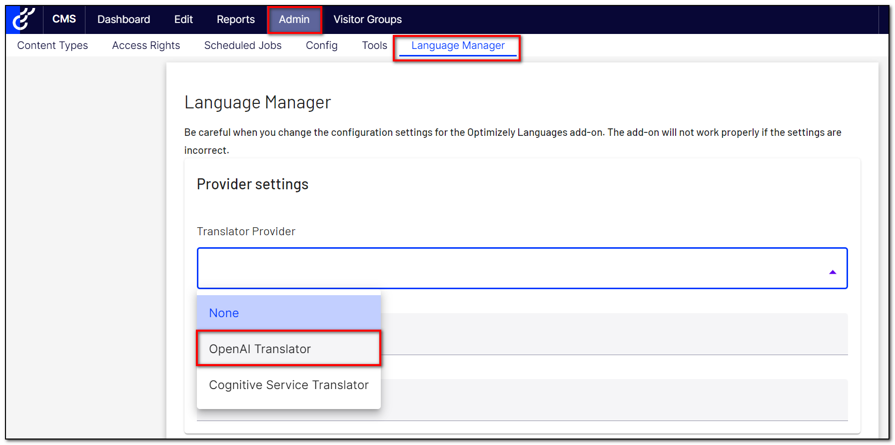
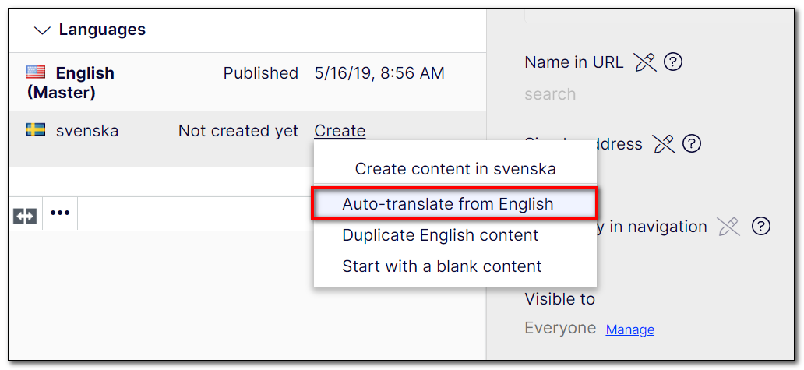

# Gulla.Episerver.Labs.LanguageManager.OpenAi 🤖

This addon for Optimizely CMS enables EPiServer.Labs.LanguageManager to auto-translate content using OpenAI.

## Installation

The command below will install the addon in your Optimizely project.

```
dotnet add package Gulla.Episerver.Labs.LanguageManager.OpenAi
```

## Configuration

For this addon to work, you will have to call the `.AddLanguageManagerOpenAi()` extension method in the Startup.ConfigureServices method.

Below is a code snippet with all possible configuration options. The only required configuration is `OpenAiApiKey`.

```csharp
.AddLanguageManagerOpenAi(x => {
    x.OpenAiApiKey = "**********";
    x.OpenAiModel = "gpt-3.5-turbo";
    x.OpenAiTemperature = 0.7;
    x.OpenAiExtraPrompt = "Make the translation super, super formal.";
})
```

The default values are

-   OpenAiModel = "gpt-4o"
-   OpenAiTemperature = 0.7

You can also configure SqlStudio using `appsettings.json`. A configuration setting specified in `appsettings.json` will override any configuration configured in `Startup.cs`. See the example below:

```JSON
  "Gulla": {
    "LanguageManagerOpenAi": {
      "OpenAiApiKey": "**********",
      "OpenAiModel": "gpt-3.5-turbo"
      "OpenAiTemperature": 0.7,
      "OpenAiExtraPrompt": "Make the translation super, super formal.",
    }
  }
```

In order for LangageManager to use this OpenAI Provider, configure it like this.


## Usage

Add the Languages gadget, and auto-translate all you want!


## Contribute

You are welcome to register an issue or create a pull request if you see something that should be improved.
